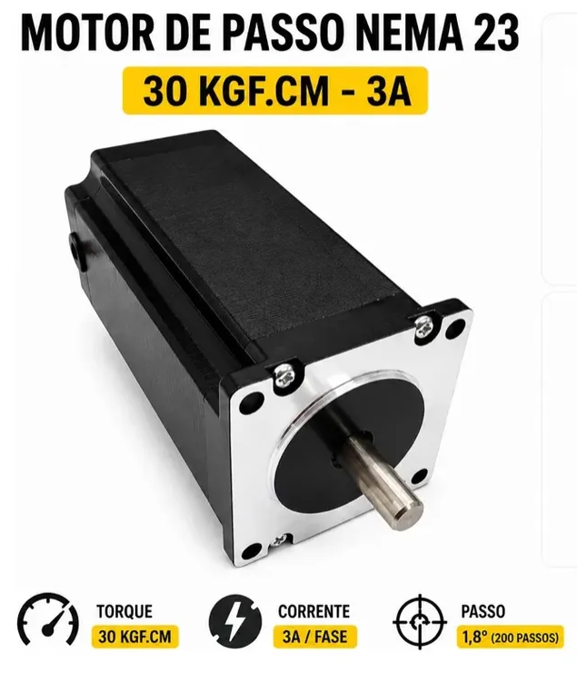

# STM32H562RGT6 - Pêndulo invertido

Projeto de controle de pêndulo invertido utilizando STM32H562RGT6.

## Documentação

- [Lista de materiais](./boom.txt)
- [Diagrama da placa STM32](./Docs/WeAct-STM32H5_64PIN-CoreBoard_V11%20SchDoc.pdf)

## Fotos

### STM32 / Driver  / Encoder de 2500 pulsos por revolução / Motor de passo

<p float="left">
    
    
    
        
</p>

### Início da separação dos materiais


### Iniciando a configuração do STM32CubeMX

```
STMCubeMX Version 6.17.0
Start My project from MCU
  Access to mcu selector
  
  For better performance it is recommended to enable the instruction cache (ICACHE)
  and the MPU to access OTP & RO areas.
  Do you want to apply now such default configuration? (YES)
  
  Do you want to create a new project:
  (*) Without TrustZone activated?
  
  Aba Project Manager
    Project Name: STM32H562RGT6-InvPend
    Toolchain / IDE: STMCubeIDE
  
  Linker Settings
    Minimum Heap Size 0x200
    Minimum Stack Size 0x400
    
  Aba Pinout & Configuration
    System Core
      RCC
        HSE: Crystal/Ceramic Resonator
        LSE: Crystal/Ceramic Resonator
        
  Aba Clock Configuration
    Input frequency LSE: 32.768KHz
    Input frequency HSE: 8MHz
    HCLK(MHz): 250
    
    
=== Parte do encoder ===

Pinout & Configuration / Timers
  TIM2
    Combined Channels: Encoder Mode
      Configuration / Parameter Settings
        Counter Settings
          Counter Period (AutoReloadRegister 32bits): 4294967295 = 0xffffffff
          Internal Clock Division(CKD): No Division
          auto-reload preload: Enable
        Encoder
          Encoder Mode: Encoder Mode TI1 and TI2
          __ Parameters for Channel 1 ___
          Polarity: Falling Edge
          Input filter: 10
          __ Parameters for Channel 2 ___
          Polarity: Falling Edge
          Input filter: 10   
      Configuration / NVIC Settings
        TIM2 global interrupt (*)

        

```

### Conexão do encoder rotativo OMCH 2500PR, Optoelectronic, E6B2-CWZ6C

```


- Shiel F.G - GND --------- GND
- Brown ----- Vdc 5 a 24V - 5V
- Blue ------ OV ---------- GND
- Black ----- Out A phase - PA0
- White ----- Out B phase - PA1
- Orange ---- Out Z phase - Não conectado

Obs.: Out Z phase -> Gera 1 pulso por revolução. (Não utilizei)
      Se o canal A muda antes do B -> gira em um sentido.
      Se o B muda antes do A -> gira no outro.
      Output circuit configuration: NPN Open-collector output
      Maximum response frequency: 100KHz

```


```

Rascunho:
#include <stdio.h>

Obs.: Tentei utilizar o val_encoder = __HAL_TIM_GET_COUNTER(&htim2);
      Mas tive que utilizar TIM2->CNT
      Estava alterando valor do contador assim que executava __HAL_TIM-GET....
      
```      
