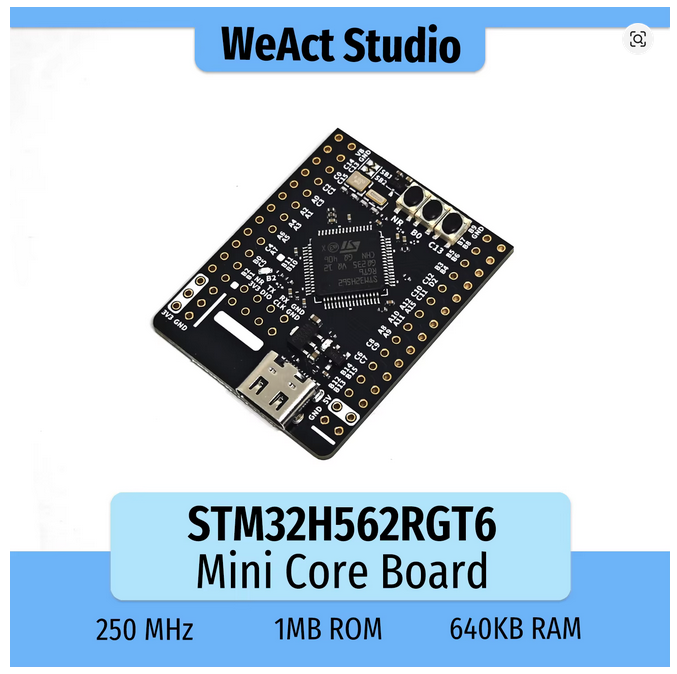
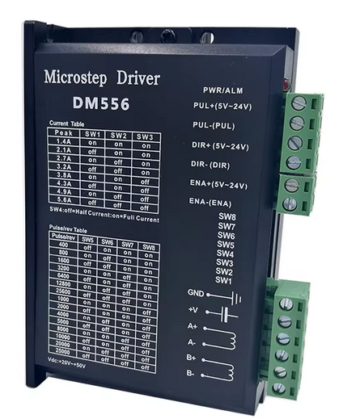
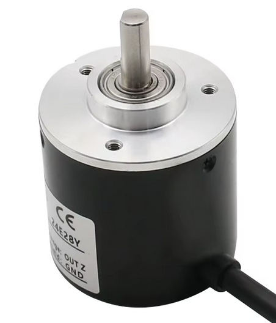
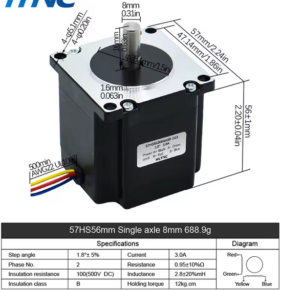
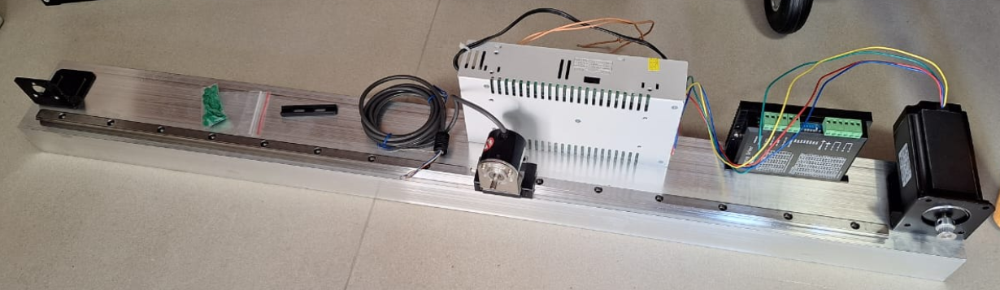

# Pêndulo invertido

Projeto experimental de um sistema de pêndulo invertido utilizando STM32H562RGT6, driver DM556 e motor de passo para estudo de controle PID e LQR. O objetivo é desenvolver uma plataforma open-source para estudos de sistemas instáveis.

## Estratégia de Controle

O projeto utiliza duas etapas principais de controle:

### Swing-Up

Responsável por elevar o pêndulo da posição inferior até próximo da vertical,
através do controle da energia do sistema.

O algoritmo aplica acelerações controladas no carrinho para aumentar
gradualmente a energia do pêndulo até atingir a região de captura.

### Estabilização

Após atingir a região próxima da vertical, o sistema troca automaticamente
para o controlador de estabilização.

Controladores previstos:

- PID
- LQR

A transição entre Swing-Up e estabilização ocorre automaticamente
baseada no ângulo do pêndulo.


## Documentação

- [Lista de materiais](./boom.txt)
- [Diagrama da placa STM32](./Docs/WeAct-STM32H5_64PIN-CoreBoard_V11%20SchDoc.pdf)

## Fotos

### STM32 / Driver  / Encoder de 2500 pulsos por revolução / Motor de passo

<p float="left">
    
    
    
        
</p>

### Início da separação dos materiais




### Iniciando a configuração do STM32CubeMX

```
STMCubeMX Version 6.17.0
Start My project from MCU
  Access to mcu selector
  
  For better performance it is recommended to enable the instruction cache (ICACHE)
  and the MPU to access OTP & RO areas.
  Do you want to apply now such default configuration? (YES)
  
  Do you want to create a new project:
  (*) Without TrustZone activated?
  
  Aba Project Manager
    Project Name: STM32H562RGT6-InvPend
    Toolchain / IDE: STMCubeIDE
  
  Linker Settings
    Minimum Heap Size 0x200
    Minimum Stack Size 0x400
    
  Aba Pinout & Configuration
    System Core
      RCC
        HSE: Crystal/Ceramic Resonator
        LSE: Crystal/Ceramic Resonator
        
  Aba Clock Configuration
    Input frequency LSE: 32.768KHz
    Input frequency HSE: 8MHz
    HCLK(MHz): 250
    
    
=== Parte do encoder ===

Pinout & Configuration / Timers
  TIM2
    Combined Channels: Encoder Mode
      Configuration / Parameter Settings
        Counter Settings
          Counter Period (AutoReloadRegister 32bits): 4294967295 = 0xffffffff
          Internal Clock Division(CKD): No Division
          auto-reload preload: Enable
        Encoder
          Encoder Mode: Encoder Mode TI1 and TI2
          __ Parameters for Channel 1 ___
          Polarity: Falling Edge
          Input filter: 10
          __ Parameters for Channel 2 ___
          Polarity: Falling Edge
          Input filter: 10   
      Configuration / NVIC Settings
        TIM2 global interrupt ( )  Obs.: Interupção de over ou underflow, não ativado.
      Configuration / GPIO Settings
        Fazer para PA0 e PA1
        GPIO pull-up/Pull-down: Pull-up
        
        
=== Configurar GPIO's de saída para PUL-, DIR- e ENA- ===
Pinout & Configuration
  PA8, PA9 e PA10 como GPIO_Output
  PA8 com label: PUL
  PA9 com label: DIR
  PA10 com label: ENA
  GPIO mode: Output Open Drain (Configurado como coletor aberto pelo fato do PUL+, DIR+ e ENA+
                                esta conectado no 5VDC)

```

### Conexão do encoder rotativo OMCH 2500PR, Optoelectronic, E6B2-CWZ6C

```

  Conexão do Encoder ------  STM32 -------
- Shiel F.G - GND ---------  GND
- Brown ----- Vdc 5 a 24V -  5V
- Blue ------ OV ----------  GND
- Black ----- Out A phase -  PA0
- White ----- Out B phase -  PA1
- Orange ---- Out Z phase -  Não conectado

Obs.: Out Z phase -> Gera 1 pulso por revolução. (Não utilizei)
      Se o canal A muda antes do B -> gira em um sentido.
      Se o B muda antes do A -> gira no outro.
      Output circuit configuration: NPN Open-collector output
      Maximum response frequency: 100KHz

```

### Configuração do driver do motor de passo DM556 para o Motor de passo 57HS56-3004A08-D21

O driver tem um bloco de chaves com 8 dip switch, para descrição de cada um, veja imagem do driver acima. 
Adicionei esta tabela abaixo em função da figura não ter RMS, mas pode ser calculada assim (Peak = RMS * 1.4)
A corrente que vem estipulada no motor é RMS, no caso 3A, selecionei 2.7A RMS, um pouco abaixo da corrente do motor.

```

+-------------+
| Peak | RMS  |
+------+------+
| 2.1A | 1.5A |
+------+------+
| 2.7A | 1.9A |
+------+------+
| 3.2A | 2.3A |
+------+------+
| 3.8A | 2.7A |
+------+------+
| 4.3A | 3.1A |
+------+------+
| 4.9A | 3.5A |
+------+------+
| 5.6A | 4.0A |
+-------------+

Ficou assim:
SW1 = on  -\
SW2 = on   +--> Corrente RMS 2.7A
SW3 = off -/

SW4 = off = Half Current (Quando motor tiver parado, é energizado com meia corrente,
            salvo se ENA estiver desativado, neste caso o motor roda livre)

SW5 = off -\
SW6 = on    \ 400 pulsos por revolução
SW7 = on    /
SW8 = on  -/

Ligações GPIOs do STM32 ao Driver. Obs.:(PUL+, DIR+ e ENA+ ligado ao 5VDC)
PA8  = PUL-
PA9  = DIR-
PA10 = ENA- 


```   
